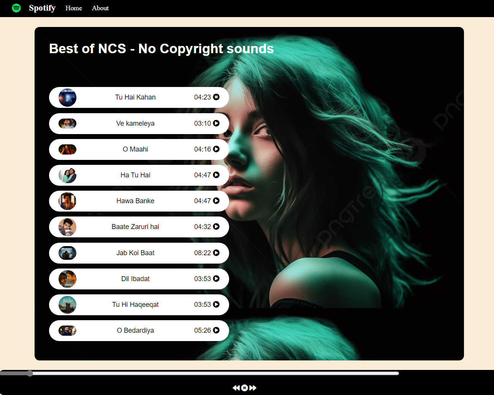

MeloMix

Developed a fully functional Spotify clone with a user-friendly interface.
Implemented features such as music playback, playlist creation, and user authentication.
Utilized technologies including HTML, CSS, and JavaScript for the frontend, with potential backend technologies.
Successfully deployed the project on Netlify, ensuring accessibility for users.

Checkout on netlify : "https://asiya-spotify-clone.netlify.app/"

THINGS TO IMPROVE

Feature Expansion:

Introduce additional features such as creating and managing playlists, following artists, exploring genres, and accessing personalized recommendations.

Implement social features like sharing playlists or songs with friends, following other users, and collaborative playlist creation.

Integrate music discovery functionalities such as radio stations, podcasts, or curated playlists based on mood or activity.
